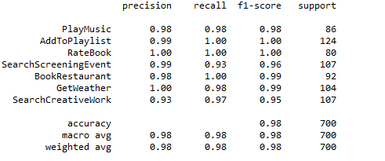
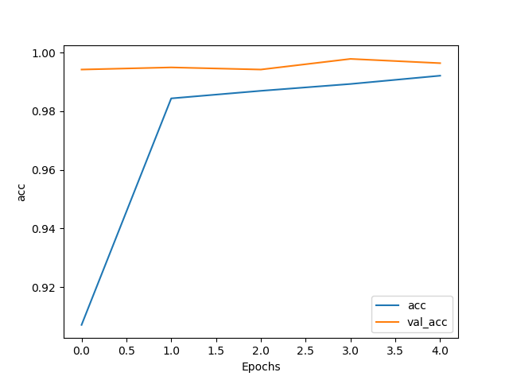
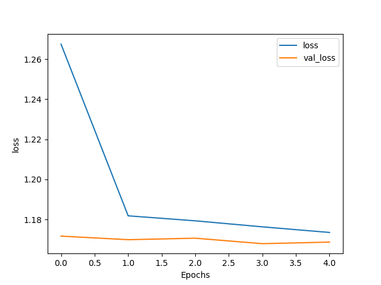

# Intent-Detection
The objective of this project is to detect intent from texts. For this, a benchmark dataset is used, which includes 7 intents (Search Creative Work, get weather, Book Restaurant, Play Music, Add to Playlist, Rate Book, Search Screening Event) and 14 thousand samples. Transfer learning has been leveraged to train a machine learning model. The model takes the raw texts, which are tokenized and vectorized to feed into the pre-trained model. Overall, 98 % accuracy is achieved in detecting the intents from the trained model.

The data is collected from the following link:  
https://github.com/snipsco/nlu-benchmark/tree/master/2017-06-custom-intent-engines

• Tensorflow 2.0 is used. 
• BERT-base model is used (12-layer, 768-hidden, 12-heads) combining with a few dropout and dense layers. 
• bert-for-tf2 package is used to train. 
• 98% accuracy is achieved.

# Performance 

# Accuracy 

# Loss

# How to run
Please check intentDetection.py script.

# Acknowledgement
Please check the following source which was very helpful for this project:
https://www.curiousily.com/posts/intent-recognition-with-bert-using-keras-and-tensorflow-2/
